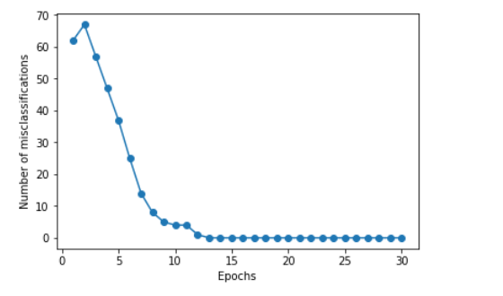
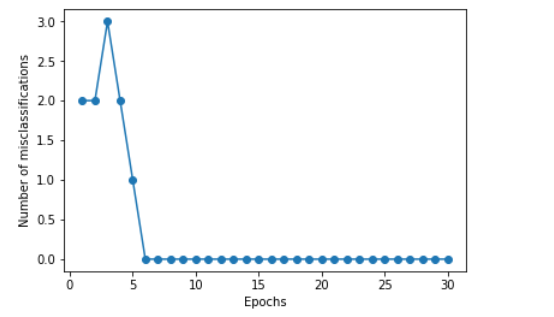
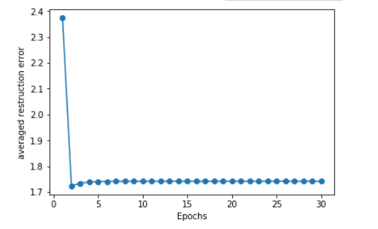
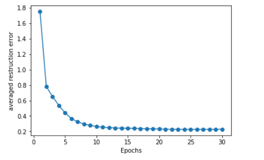

# Pattern recognition assignment-Part 1
This part utilizes the perceptron model and neural network model to complete the classfication task on UCI/ICS dataset. Besides, single hidden layer autoencoder and multi hidden layer autoencoder are implemented. This work is totally based on basic python libs like numpy and pandas. No modern deep learning frameworks like pytorch/tensorflow/Mxnet/Keras are employed. 

## Classifier

The classification error curves of neural network (Light)  and neural perceptron (Right) are  shown below:

    
    

## Autoencoder

The averaged reconstruction errors obtained by multi hidden layers autoencoder (Light) and single hidden layer autoencoder (Right) are shown below:

    
    

@@@ 
