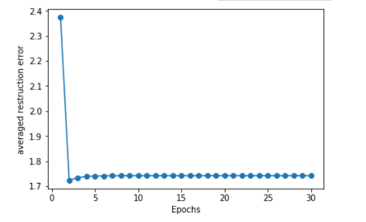

# Pattern recognition assignment-Part 1
This part utilize the perceptron model and neural network model to achieve the classfication task on UCI/ICS dataset. Besides, single hidden layer autoencoder and multi hidden layer autoencoder are implemented. 

## Classifier

The classification error curves of neural network (Light)  and neural perceptron (Right) are  shown below:

    
    

## Autoencoder

The averaged reconstruction errors obtained by multi layer autoencoder (Light) and single layer autoencoder (Right) are shown below:

    
    

@@@ 
